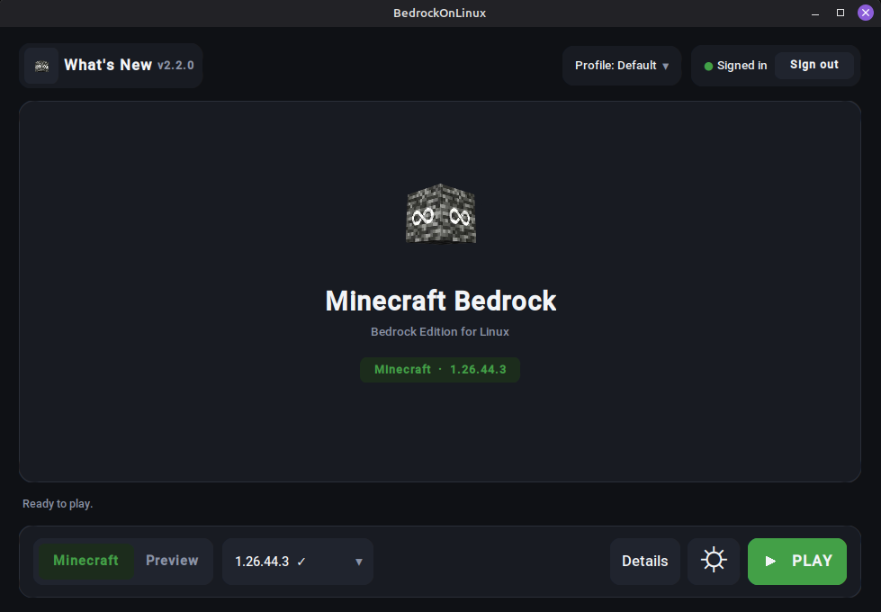

<div align="center">

# 🟩 BedrockOnLinux

**Minecraft Bedrock for Windows, running on Linux — with real Xbox sign-in,
Friends, servers and Realms.**

[Website](https://wyze3306.github.io/BedrockOnLinux/) ·
[Latest release](https://github.com/Wyze3306/BedrockOnLinux/releases/latest) ·
[Discord](https://discord.gg/5YJq54Yhbu) ·
[Report a bug](https://github.com/Wyze3306/BedrockOnLinux/issues) ·
[MIT license](LICENSE)

`Ubuntu` · `Debian` · `Linux Mint / LMDE` · `Fedora` · `Arch` · `openSUSE`



</div>

---

## How it works

BedrockOnLinux downloads Minecraft from the Microsoft Store with your own
account, prepares a Wine prefix for it, and runs the game on a GDK-Proton
engine built from a WineGDK fork. You never need a compiler, a Windows install
or a second machine.

The download is the real one. [Xodus](https://github.com/xodus-gaming/xodus)
signs in to your Microsoft account, asks Microsoft's licensing service for the
title licence, and streams the MSIXVC package straight from the Xbox CDN,
decrypting it as it goes — the same path Windows takes. **Your account has to
own Minecraft.** Earlier releases pulled a repackaged copy of the game from a
third-party repository instead; that is gone.

The point of the engine is that the Xbox side is **implemented, not faked**:

- **Real Microsoft identity.** XGame configuration, XUser, request signing,
  gamertags, privileges and the XSAPI context are native code inside the
  engine. You sign in to Microsoft from inside Minecraft, exactly as on
  Windows.
- **Real online play.** Friends, invitations, joining a friend's world, public
  servers and Realms all run on that identity. Realms gets its own XSTS token
  for the Bedrock Realms audience rather than a generic Xbox one.
- **No account relay, no multiplayer proxy.** Sign-in happens directly between
  your machine, Microsoft and Xbox. Nothing is routed through a third party.
- **No memory patching.** The engine never scans or rewrites the running
  Minecraft process, and packaging refuses an archive that still contains the
  old process-memory code. Compatibility fixes are static and fingerprinted,
  applied before the game starts.
- **Real file dialogs.** The engine implements the WinAppSDK picker for both
  Windows architectures, so Minecraft's *Import World* and custom-skin
  selection open your desktop's file chooser instead of failing deep in
  `RoGetActivationFactory`.

Around that sit the things a launcher should handle for you: SHA-256 pinned
engine updates that roll back cleanly, a graphics-safety check that runs
before Wine does, and separate Xbox profiles for everyone who shares the
machine.

## Install

Grab the file you want from the
[latest release](https://github.com/Wyze3306/BedrockOnLinux/releases/latest).
Every supported build is x86-64.

| Format | Best for | How to start it |
|---|---|---|
| AppImage | Most glibc desktops | `./BedrockOnLinux-*-x86_64.AppImage` |
| `.deb` | Debian, Ubuntu, Mint, LMDE | `sudo apt install ./bedrock-on-linux_*_amd64.deb` |
| `.rpm` | Fedora, Nobara | `sudo dnf install ./bedrock-on-linux-*.x86_64.rpm` |
| Flatpak bundle | Atomic systems such as Bazzite | `flatpak install --user ./BedrockOnLinux-*-x86_64.flatpak` |
| Portable `.pyz` | A host that already has Python and Tk | `./bedrock-on-linux-*.pyz gui` |

The AppImage carries its own Python, Tk, GUI toolkit, `cryptography` and CA
certificates; it still uses your graphics driver and the usual X11, Xft and
fontconfig libraries. The `.deb` and `.rpm` declare their dependencies and
bundle the same pinned GUI toolkit. The `.pyz` uses your system Python and can
install its two pinned Python dependencies on first use.

If FUSE is missing, the AppImage can unpack itself instead:

```bash
APPIMAGE_EXTRACT_AND_RUN=1 ./BedrockOnLinux-*-x86_64.AppImage
```

### The engine download

The first **PLAY** needs the engine archive that matches the launcher:

```text
GDK-Proton-xuser-<engine-revision>.tar.gz
```

Online, the launcher fetches it from the release automatically. You can also
drop that asset next to the AppImage or `.pyz` — a matching local copy wins,
and is verified before anything is extracted. That is how you test an
unpublished build, and how you do a first install offline.

Existing installs upgrade the same way on their next **PLAY**. The new engine
is validated before an atomic swap, and a failed download, disk-full, bad
extraction or hash mismatch leaves the working engine exactly where it was.

### Flatpak

The Flatpak keeps everything in its private folder:

```text
~/.var/app/io.github.wyze3306.BedrockOnLinux/data/bedrock-on-linux/
```

Coming from an older native install, the launcher copies
`~/.local/share/bedrock-on-linux` into that private folder once, atomically,
before any command can write there. The manifest grants read-only access to
that one path for the transition; the host copy stays behind as a backup, and
two populated data folders are never merged automatically. If a local override
removed that access, restore it just long enough to migrate:

```bash
flatpak kill io.github.wyze3306.BedrockOnLinux
flatpak override --user \
  --filesystem='~/.local/share/bedrock-on-linux:ro' \
  io.github.wyze3306.BedrockOnLinux
flatpak run io.github.wyze3306.BedrockOnLinux
```

Check your account, worlds and selected version in the private folder, then
drop the override.

## Play

1. Open **BedrockOnLinux**.
2. Choose **Sign in**, open the Microsoft device-code page it shows you and
   type the code. This is optional — without an account, or without a working
   route to Xbox Live, the game starts in offline mode: single-player worlds
   and LAN play work, and only Realms, servers, the Marketplace and Xbox
   friends stay out of reach.
3. Pick an edition — **Minecraft** or **Minecraft Preview** — and hit
   **▶ PLAY**. The first PLAY asks you to link the Microsoft account that owns
   the game, in a separate Store sign-in window; this one is not optional,
   because it is what authorises the download.
4. Use Minecraft's **Friends**, **Servers** and **Realms** tabs as usual.

The first run downloads Minecraft, then the engine and its online/TLS payload,
and verifies both. Later runs reuse them. Your credentials live in the private
BedrockOnLinux data folder and are seeded into the stopped Wine prefix just
before launch.

If the Store package keeps the game executable encrypted — which is what
Windows gets too — the licence is fetched at every launch, so starting the game
needs the network and a valid Store session even for a single-player world.
Packages that ship a plaintext executable start offline as before.

You pick the build. Microsoft's own service only ever offers the current one,
but its CDN keeps the older builds reachable and
[GdkLinks](https://github.com/MinecraftBedrockArchiver/GdkLinks) indexes where
they live, so the picker lists every build of the edition you chose — which is
what lets you match a server frozen on one. That index holds no game data: it
only says where on `assets*.xboxlive.com` a build sits, and the licence still
comes from Microsoft for your account. Each build installs into its own folder,
so switching back to one you already have costs nothing.

```bash
bedrock-on-linux versions                          # every build, per edition
bedrock-on-linux setup --mc release --version 1.26.44.3
```

### Steam, Steam Deck and the app menu

Once a version is installed and an account is linked, Minecraft can start on
its own. **Tools ▸ Create direct launch shortcut** writes a *Minecraft Bedrock*
desktop entry, or from a terminal:

```bash
bedrock-on-linux shortcut                     # desktop entry + printed command
bedrock-on-linux shortcut --profile "Alice"   # one isolated profile
bedrock-on-linux play                         # the same launch, right now
```

In Steam, use **Add a Non-Steam Game** and pick that entry, or paste the
printed command. It shows up in your library and in Steam Deck Game Mode, with
Steam Input and the Deck's fullscreen handling like any other non-Steam game.
Right-clicking the launcher's own icon also offers **Play without the
launcher**, so you may not need a second entry at all. Inside the Flatpak,
where host shortcuts cannot be written from the sandbox, use that action or add
`flatpak run io.github.wyze3306.BedrockOnLinux play` to Steam by hand.

Adding the launcher itself to Steam works too, and starting it opens the
launcher — in Game Mode just like on the desktop. Game Mode only shows one
window at a time, so **▶ PLAY** hands the screen over: the launcher disappears
while Minecraft runs and comes back when you quit. Picking between the two
Steam entries is a real choice, not a workaround — the launcher for
installing, signing in and changing settings from the Deck, the *Minecraft
Bedrock* shortcut for dropping straight into the game.

A launcher-free launch does no first-run work: it has nowhere to show a device
code or a version picker, so install and sign in once before you create the
shortcut (`shortcut` tells you when either is still missing). It runs the same
guarded launch as **▶ PLAY**, graphics-safety and prefix checks included, and
turns a failure that would have gone to the launcher log into a desktop
notification.

### Several Xbox accounts on one machine

Give each player their own launcher root and shortcut:

```bash
bedrock-on-linux profiles create "Alice"
bedrock-on-linux profiles create "Bob"
bedrock-on-linux profiles list
```

Each shortcut sets its own `BOL_HOME`, so accounts, Wine prefixes, pre-auth
caches, settings and worlds stay apart, while the multi-gigabyte game, Proton,
UMU and download caches are shared. Add the matching shortcut to each Steam
user as its own non-Steam game. Created from an AppImage, a shortcut records
the real AppImage file rather than its temporary mount point. Since PLAY may
repair a shared runtime before starting, only one profile can be in-game at a
time, and setup or update is refused while another session holds the
shared-assets lock.

Create profiles *after* you settle on the **Game files location** — relocation
is refused while profiles exist, because moving their shared base would break
the links. Host-visible desktop and Steam shortcuts cannot be written from
inside the Flatpak sandbox; use the AppImage, `.deb` or `.rpm` for that.

### Worlds, add-ons and skins

Minecraft's own **Import World** and skin picker work, through the engine's
native file dialog. To install content from outside the game instead, with
Minecraft closed:

```bash
bedrock-on-linux import world.mcworld addon.mcaddon pack.mcpack \
  template.mctemplate skin.mcskin
```

`.mcworld`, `.mcaddon`, `.mcpack`, `.mctemplate` and `.mcskin` all land in the
right `com.mojang` folder. Nothing is overwritten — a free name is chosen.

### Achievements

The launcher prepares a dedicated user-only XSTS token for Minecraft's original
Windows Achievements request, and XUser hands it out for that service only. The
packaged Windows title, SCID and platform are preserved, and social,
Marketplace, PlayFab, multiplayer and Realms authentication are untouched.

This loads the list you already have. It does not unlock, emulate or force
anything, and Minecraft's own rules still apply: world settings, cheats,
Creative mode and some add-ons can make a world ineligible.

### External client DLLs

With Minecraft sitting at its main menu, **Settings ▸ Tools ▸ Inject a client
DLL…** can load a compatible 64-bit Windows client DLL into the game's Wine
prefix. Match the client release to your exact Minecraft line — a project's
"latest" download often still targets an older build. After `LoadLibrary`
returns, the launcher watches briefly for an immediate exit or a fresh Wine
crash dialog and reports that as a failed injection rather than a false
success.

BedrockOnLinux ships no client DLLs and endorses none. Their Wine
compatibility, dependencies, safety and compliance with server rules are yours
to judge. The injector works in the native, AppImage, `.deb` and `.rpm`
layouts, not in the Flatpak sandbox.

## What you need

- **An x86-64 glibc desktop.** The AppImage and the engine are checked against
  a glibc 2.31 baseline. ARM and musl-only systems such as stock Alpine are out
  of scope. You do *not* need a 32-bit userspace: the engine uses Wine's pure
  WoW64 path.
- **X11 or XWayland**, for the launcher window. The game normally uses
  XWayland too. Native Wine Wayland is available with `BOL_INPUT=wayland`, but
  it stays experimental and does not remove the launcher's own requirement.
- **A Vulkan 1.3 driver** exposing `VK_EXT_device_generated_commands`, or the
  older NVIDIA `VK_NV_device_generated_commands`. The bundled vkd3d-proton
  payload carries both and picks one inside the game process.
- **Room to spare.** Game, compressed engine and a temporary extraction all
  need space. `No space left on device` is harmless: free some and press PLAY
  again.
- **A Microsoft account that owns Minecraft.** This is now required to install
  the game at all, not only to play online: the download comes from the
  Microsoft Store under your own licence. Friends, multiplayer and Realms
  additionally depend on that account's privacy settings, any Realms
  subscription or invitation, and Microsoft's services being up. Single-player
  and LAN need none of *those*.
- **WebKitGTK** (`libwebkit2gtk-4.1-0`), for the Store sign-in window. The
  `.deb` and `.rpm` pull it in, the Flatpak gets it from its runtime, and
  `bedrock-on-linux doctor` reports it if it is missing.

GPUs stuck on Vulkan 1.2 can try **Settings ▸ Advanced ▸ Legacy compatibility
renderer**, but treat it as a last resort: it swaps the entire Direct3D stack —
D3D9 through D3D12 — to WineD3D, dropping both DXVK and vkd3d-proton. Minecraft
renders purely through D3D12, so this replaces exactly the renderer it uses.
Artifacts are common, ray tracing is gone, and performance may not improve.

**Settings ▸ Advanced ▸ Ray tracing** decides whether Minecraft is handed DXR at
all. It is on by default, because the bundled vkd3d-proton reports the ray
tracing tier by itself on any driver exposing the Vulkan ray tracing extensions
— on an RTX 4060 the game sees `RaytracingTier 1.1` and full DirectX 12
Ultimate. The switch's job is therefore to keep a `VKD3D_CONFIG=nodxr` inherited
from your session from quietly removing that, and to put `nodxr` back when you
would rather have the video memory. What it cannot do is satisfy the rest of
Minecraft's own conditions: **Settings ▸ Video ▸ Graphics Mode ▸ Ray Traced**
stays uneditable without a ray-tracing-capable world on top of a capable GPU,
and the game says so in its own tooltip. *Vibrant Visuals* is deferred
rendering rather than ray tracing, and this switch does not touch it.

BedrockOnLinux is an independent compatibility project, not affiliated with or
supported by Mojang or Microsoft. Minecraft updates can move private game
interfaces without warning; when a new version regresses, pick a known-good one
and attach diagnostics.

## GPU safety

The launcher deliberately never opens a Vulkan or OpenGL device just to find
out whether your driver is healthy. It reads state that already exists, and can
recognise:

- an X11 session with no hardware RandR provider;
- an FBDEV or software-rendering fallback;
- a fatal graphics-driver event in the kernel journal;
- a Minecraft GPU session that never returned before a reboot or power cut.

That last one is written down by a durable launch marker. A clean shutdown
retires it once the Wine prefix goes idle, and a separate durable
wrapper-return phase means a slow-but-normal Wine teardown no longer turns into
a permanent same-boot block. Markers written by older versions cannot tell the
userspace crash from issue
[#31](https://github.com/Wyze3306/BedrockOnLinux/issues/31) apart from a real
driver failure, so they still need the one-time acknowledgement below.

**If your desktop froze or you had to cut the power, do not just retry.** Find
out why the session died and reboot. If the kernel log shows a fatal GPU event,
fix or update the driver first — a marker on its own does not prove a driver
fault. Once the launcher can prove the incident belongs to a previous boot,
**Settings ▸ Tools** offers **Acknowledge previous GPU incident…** behind a
confirmation. The same thing from a terminal:

```bash
bedrock-on-linux doctor
bedrock-on-linux doctor --acknowledge-gpu-crash
```

Acknowledgement is re-checked while the launch lock is held. It clears an old
interrupted-session block or records a previous-boot driver incident, and
nothing else. It is refused when there is no eligible incident, when Wine or
UMU is still running, when the marker belongs to this boot, when its origin
cannot be read, or when the current kernel journal shows a GPU fault. An unsafe
display state stays blocked either way. The override below exists for a
confirmed false positive only, and can put you back in front of a kernel hard
lock:

```bash
BOL_ALLOW_UNSAFE_GPU=1 bedrock-on-linux play
```

## Diagnostics and recovery

**Settings ▸ Open logs folder**, or:

```text
$XDG_DATA_HOME/bedrock-on-linux/logs/
```

`XDG_DATA_HOME` defaults to `~/.local/share`, and `BOL_HOME` or a location you
picked in Settings replaces that root. Flatpak uses its private path from the
install section. When a change of root triggers the one-time copy, the old data
and UMU trees are kept as backups — delete them yourself, after checking the
new location.

The **Details** panel holds the live launcher log. From a terminal:

```bash
bedrock-on-linux doctor                    # host dependencies and GPU safety
bedrock-on-linux doctor --network          # DNS/TLS, clock and VPN observations
bedrock-on-linux doctor --host 192.0.2.10  # plus the route to one LAN IP
bedrock-on-linux repair                    # rebuild the managed Wine prefix
bedrock-on-linux versions [--beta]         # editions you can install
bedrock-on-linux setup --mc release        # download and prepare an edition
bedrock-on-linux import <files…>           # worlds, add-ons, packs, skins
bedrock-on-linux profiles list             # isolated local Xbox profiles
bedrock-on-linux store-login               # link the account that owns the game
bedrock-on-linux login                     # link a Microsoft account (in-game)
bedrock-on-linux play                      # launch the selected edition
bedrock-on-linux shortcut                  # desktop/Steam entry, no GUI
bedrock-on-linux update                    # check for a launcher update
bedrock-on-linux changelog                 # what the latest release changed
```

`bedrock-on-linux` is on `PATH` for the `.deb` and `.rpm` only. The AppImage,
`.pyz` and Flatpak run through their own entry point — use
`./BedrockOnLinux-*.AppImage doctor …`, `./bedrock-on-linux-*.pyz doctor …` or
`flatpak run io.github.wyze3306.BedrockOnLinux doctor …`. Launcher messages
always print the exact command for the install you are running.

Network diagnostics are read-only. They resolve and open certificate-verified
TLS connections to the Xbox, PlayFab and Minecraft endpoints, report NTP/RTC
state and any obvious VPN or container bridge, and can show the kernel route to
one literal host IP. A route does not prove that host accepts RakNet on UDP
19132, so the doctor will not pretend an unanswered UDP probe is a port test.
It also recognises `InitialConnection-13`, `InitialConnection-25` and explicit
version-mismatch signatures in the logs, and says what the host should do.

A Friends world reporting **full** often comes from the remote host, not from
you. Once both sides run the same build, the Windows host owner should switch
the active network profile from **Public** to **Private**, toggle
**Multiplayer Game** off and on for that world, then fully restart both games.
A guest cannot apply that fix; when nobody owns the host, use a properly
configured Bedrock Dedicated Server instead. BedrockOnLinux cannot reach into a
remote host or undo a Minecraft service regression.

`repair` resets compatibility state, not your graphics driver. Back up anything
you care about before editing the data directory by hand. Bug reports are much
easier to act on with the launcher version, engine revision, Minecraft version,
distribution, GPU and driver, plus the relevant logs — never post account
tokens or the private authentication folder.

### If the game runs slowly

`doctor` and every launch report the causes of poor frame rates that are not
the engine. None of them leaves anything in a Wine or vkd3d log, which is why
they get reported as engine or GPU faults:

- **the host is out of memory**, so the kernel pages the game out and every
  chunk comes back through a disk fault — the freezes usually blamed on the
  GPU;
- **the data directory is nearly full**, so vkd3d cannot keep its shader cache
  and recompiles pipelines every session;
- **the render distance is set past what Bedrock's main thread can feed** —
  that ring is built on one thread and the work grows with the square of the
  distance, so a fast GPU simply idles;
- **vsync is on while the game runs in a window**, on a desktop that
  composites every window, which stacks a second frame queue on the game's own.

These are advisories: nothing is blocked and none of your settings is changed.
`BOL_SKIP_PERF_CHECK=1` silences them. Two neighbours work the same way —
`BOL_SKIP_NTSYNC_CHECK=1` for Wine's synchronization fast path, and
`BOL_SKIP_DGC_CHECK=1` for the Intel discrete GPU notice.

## Engine integrity

The engine is not built on your computer. Maintainers build it from pinned
inputs, and the launcher accepts only the revision and archive SHA-256 recorded
in [`bol/config.py`](bol/config.py).

- WineGDK is built in an unprivileged Debian 11 (Bullseye) chroot, and every
  resulting ELF is rejected if it needs a glibc symbol newer than 2.31.
- The exact WineGDK source commit, the reviewed patches and per-file hashes
  live under [`third_party/`](third_party/).
- The universal vkd3d-proton build carries reviewed EXT-DGC and restored NV-DGC
  variants for x86-64 and i386; its inputs and output hashes are written down in
  [`third_party/vkd3d-proton-universal/README.md`](third_party/vkd3d-proton-universal/README.md).
- `scripts/package-engine.sh` embeds licences, build records, provenance and an
  `engine-manifest.json` hashing every critical runtime file. The finished
  archive is extracted and re-checked before it counts as a candidate.
- Installation uses a lock and a transactional rename, so an interrupted or
  invalid update can never quietly become the active engine.

The Xbox and WinAppSDK work is built for both PE architectures, and the
packager verifies the XGame/XUser markers, the file-picker registration and the
absence of the old memory-patcher code before it writes the archive.

## Build from source

Application builds expect the matching engine and OpenSSL XCurl assets to be in
`dist/` already; the release scripts will not download or invent substitutes.

```bash
# WineGDK, from pinned sources in a clean Bullseye work directory
scripts/build-winegdk-bullseye.sh /path/to/empty-workdir /path/to/WineGDK

# The reviewed universal vkd3d-proton payload, when you do not have it
scripts/build-vkd3d-universal.sh /path/to/empty-vkd3d-workdir

# Package the engine from reviewed inputs and the WineGDK build prefix
scripts/package-engine.sh \
  /path/to/staged/GDK-Proton-xuser \
  /path/to/vkd3d-proton-3.0.1-universal-dgc \
  "$(python3 -c 'from bol.config import WINEGDK_SOURCE_COMMIT; print(WINEGDK_SOURCE_COMMIT)')" \
  /path/to/GDK-Proton10-32.tar.gz \
  /path/to/empty-workdir/prefix

# .deb, .rpm, AppImage, portable .pyz and Flatpak candidates, then checks
scripts/build-release.sh
scripts/verify-release-candidate.sh

# Install the exact local sidecar and run it; publishes nothing
scripts/run-candidate.sh gui

# Local Flatpak rebuild. For publication, pin the release tag and commit in
# the manifest first, then add --release.
scripts/build-flatpak.sh
```

`scripts/build-release.sh` only writes candidates and checksums into `dist/`,
and its Flatpak is a working-tree development bundle on purpose. It does not
tag, push or upload anything. When engine contents or packaging change, bump
the engine revision, update the reviewed archive hash in `bol/config.py`, run
the full test suite and smoke-test the exact candidate before publishing.

## Legal

BedrockOnLinux ships **no Minecraft game files**, and no longer redistributes
them by proxy either. The game is downloaded from Microsoft's own CDN, under
your own account's licence, by [Xodus](https://github.com/xodus-gaming/xodus) —
so you must own Minecraft, and you must follow the terms that come with it. A
local copy you already have can be used instead.

Xodus is GPL-3.0. The launcher never links it: `xodus-cli` is executed as a
separate program, and the release that ships the binary also publishes the
matching source. See [`third_party/xodus/README.md`](third_party/xodus/README.md).

WineGDK, GDK-Proton, vkd3d-proton and the bundled dependencies keep their own
licences, and the engine carries their notices and provenance. BedrockOnLinux
itself is MIT — see [`LICENSE`](LICENSE).
